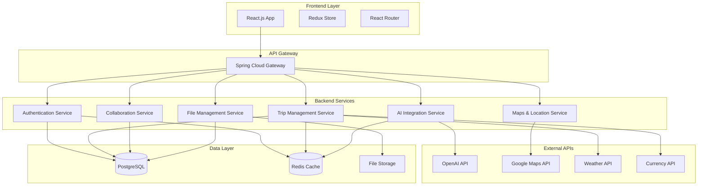
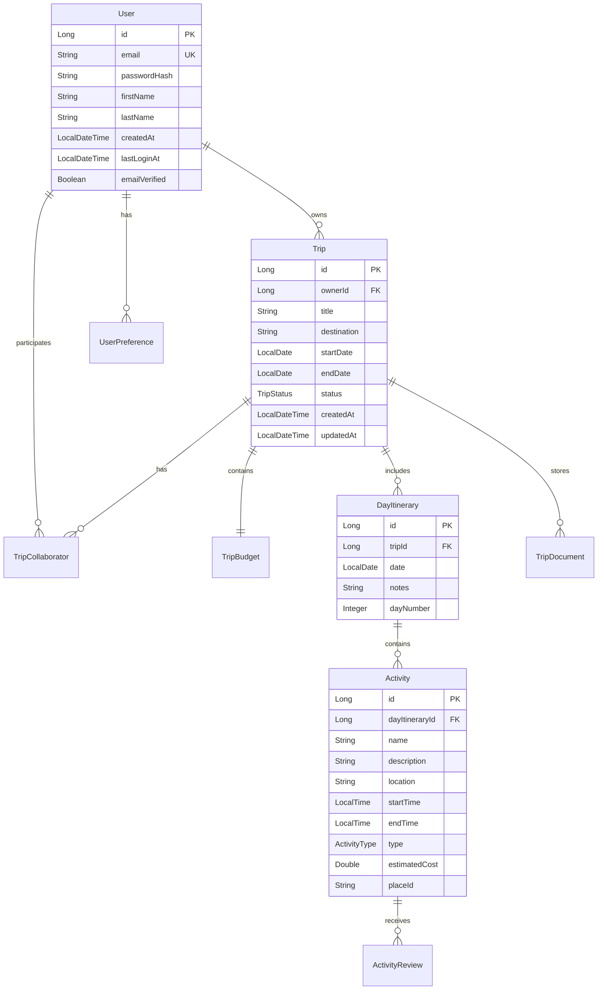

# Design Document

## Overview

Planora is designed as a modern, scalable travel planning platform with a Java Spring Boot backend and React frontend. The architecture emphasizes separation of concerns, with the backend handling all business logic, data processing, AI integrations, and API services, while the frontend focuses purely on user interface and experience.

### Key Design Principles

- **Backend-Heavy Architecture**: Maximum logic in Java backend to ensure consistency, security, and maintainability
- **API-First Design**: RESTful APIs with comprehensive documentation for frontend consumption
- **Microservices-Ready**: Modular design that can evolve into microservices as the platform scales
- **AI-Centric**: Deep integration with AI services for personalized travel recommendations
- **Real-time Collaboration**: WebSocket support for group trip planning features

## Architecture

### High-Level Architecture



### Technology Stack

**Backend:**
- Java 17+ with Spring Boot 3.x
- Spring Security for authentication
- Spring Data JPA with PostgreSQL
- Spring WebSocket for real-time features
- Redis for caching and session management
- AWS S3 for file storage
- Docker for containerization

**Frontend:**
- React 18 with TypeScript
- Redux Toolkit for state management
- React Router for navigation
- Tailwind CSS for styling
- Axios for API communication

**External Integrations:**
- OpenAI API for AI-powered recommendations
- Google Maps API for location services
- Weather API for travel forecasts
- Currency exchange API for budget planning

## Components and Interfaces

### Core Backend Components

#### 1. User Management Service

**Responsibilities:**
- User registration and authentication
- Profile management and preferences
- JWT token generation and validation
- Password reset and email verification

**Key Classes:**
```java
@Entity
public class User {
    private Long id;
    private String email;
    private String passwordHash;
    private UserProfile profile;
    private Set<TravelPreference> preferences;
    private LocalDateTime createdAt;
    private LocalDateTime lastLoginAt;
}

@Service
public class UserService {
    public User registerUser(UserRegistrationDto dto);
    public String authenticateUser(LoginDto dto);
    public User updateProfile(Long userId, UserProfileDto dto);
    public void resetPassword(String email);
}
```

#### 2. Trip Management Service

**Responsibilities:**
- CRUD operations for trips
- Itinerary generation and management
- Budget tracking and estimation
- Trip sharing and permissions

**Key Classes:**
```java
@Entity
public class Trip {
    private Long id;
    private String title;
    private String destination;
    private LocalDate startDate;
    private LocalDate endDate;
    private User owner;
    private Set<User> collaborators;
    private List<DayItinerary> itinerary;
    private TripBudget budget;
    private TripStatus status;
}

@Entity
public class DayItinerary {
    private Long id;
    private Trip trip;
    private LocalDate date;
    private List<Activity> activities;
    private String notes;
}

@Service
public class TripService {
    public Trip createTrip(CreateTripDto dto, Long userId);
    public Trip updateTrip(Long tripId, UpdateTripDto dto, Long userId);
    public List<Trip> getUserTrips(Long userId);
    public Trip addCollaborator(Long tripId, String email, Long ownerId);
}
```

#### 3. AI Integration Service

**Responsibilities:**
- OpenAI API integration for recommendations
- Itinerary generation based on preferences
- Chat-based travel assistance
- Content personalization

**Key Classes:**
```java
@Service
public class AIService {
    public ItineraryRecommendation generateItinerary(ItineraryRequest request);
    public List<Recommendation> getDestinationRecommendations(RecommendationRequest request);
    public ChatResponse processChatQuery(String query, TripContext context);
    public BudgetEstimate estimateTripCost(BudgetRequest request);
}

@Component
public class OpenAIClient {
    public String generateCompletion(String prompt, Map<String, Object> context);
    public List<String> generateRecommendations(String destination, UserPreferences preferences);
}
```

#### 4. Location and Maps Service

**Responsibilities:**
- Google Maps API integration
- Location search and geocoding
- Route planning and optimization
- Points of interest discovery

**Key Classes:**
```java
@Service
public class LocationService {
    public List<Destination> searchDestinations(String query);
    public LocationDetails getLocationDetails(String placeId);
    public List<PointOfInterest> getNearbyAttractions(Coordinates coordinates);
    public RouteInfo calculateRoute(List<Coordinates> waypoints);
}

@Entity
public class Destination {
    private Long id;
    private String name;
    private String country;
    private String city;
    private Coordinates coordinates;
    private String description;
    private Double rating;
    private List<String> imageUrls;
}
```

#### 5. Collaboration Service

**Responsibilities:**
- Real-time collaboration features
- WebSocket connection management
- Change notifications and synchronization
- Conflict resolution for concurrent edits

**Key Classes:**
```java
@Service
public class CollaborationService {
    public void notifyCollaborators(Long tripId, CollaborationEvent event);
    public void handleConcurrentEdit(Long tripId, EditEvent event);
    public List<CollaborationActivity> getTripActivity(Long tripId);
}

@Component
public class WebSocketHandler {
    public void handleTripUpdate(Long tripId, UpdateMessage message);
    public void broadcastToCollaborators(Long tripId, Object message);
}
```

#### 6. File Management Service

**Responsibilities:**
- Document upload and storage
- File organization and categorization
- Secure file access and sharing
- Storage quota management

**Key Classes:**
```java
@Service
public class FileService {
    public UploadResult uploadFile(MultipartFile file, Long tripId, Long userId);
    public FileMetadata getFileMetadata(Long fileId);
    public byte[] downloadFile(Long fileId, Long userId);
    public void deleteFile(Long fileId, Long userId);
}

@Entity
public class TripDocument {
    private Long id;
    private Trip trip;
    private String fileName;
    private String fileType;
    private String s3Key;
    private Long fileSize;
    private DocumentCategory category;
    private User uploadedBy;
    private LocalDateTime uploadedAt;
}
```

### API Endpoints Design

#### Authentication Endpoints
```
POST /api/auth/register
POST /api/auth/login
POST /api/auth/refresh
POST /api/auth/logout
POST /api/auth/forgot-password
POST /api/auth/reset-password
```

#### Trip Management Endpoints
```
GET    /api/trips
POST   /api/trips
GET    /api/trips/{id}
PUT    /api/trips/{id}
DELETE /api/trips/{id}
POST   /api/trips/{id}/collaborators
DELETE /api/trips/{id}/collaborators/{userId}
GET    /api/trips/{id}/itinerary
PUT    /api/trips/{id}/itinerary
```

#### AI and Recommendations Endpoints
```
POST /api/ai/generate-itinerary
POST /api/ai/chat
POST /api/ai/recommendations
POST /api/ai/estimate-budget
GET  /api/ai/destination-insights/{destination}
```

#### Location and Maps Endpoints
```
GET /api/locations/search
GET /api/locations/{placeId}
GET /api/locations/{placeId}/nearby
POST /api/locations/route
GET /api/locations/weather/{destination}
```

## Data Models

### Core Entity Relationships



### Database Schema Considerations

**Indexing Strategy:**
- Primary keys on all entities
- Unique index on user email
- Composite index on (trip_id, date) for day_itinerary
- Index on trip owner_id and collaborator user_ids
- Full-text search index on destination names and descriptions

**Data Partitioning:**
- Consider partitioning trips by creation date for large datasets
- Separate read replicas for analytics and reporting

## Error Handling

### Exception Hierarchy

```java
@ResponseStatus(HttpStatus.BAD_REQUEST)
public class ValidationException extends RuntimeException {
    private final List<String> errors;
}

@ResponseStatus(HttpStatus.NOT_FOUND)
public class ResourceNotFoundException extends RuntimeException {
    private final String resourceType;
    private final String resourceId;
}

@ResponseStatus(HttpStatus.FORBIDDEN)
public class AccessDeniedException extends RuntimeException {
    private final String action;
    private final String resource;
}

@ResponseStatus(HttpStatus.SERVICE_UNAVAILABLE)
public class ExternalServiceException extends RuntimeException {
    private final String serviceName;
    private final String errorCode;
}
```

### Global Exception Handler

```java
@ControllerAdvice
public class GlobalExceptionHandler {
    
    @ExceptionHandler(ValidationException.class)
    public ResponseEntity<ErrorResponse> handleValidation(ValidationException ex) {
        return ResponseEntity.badRequest()
            .body(new ErrorResponse("VALIDATION_ERROR", ex.getErrors()));
    }
    
    @ExceptionHandler(ExternalServiceException.class)
    public ResponseEntity<ErrorResponse> handleExternalService(ExternalServiceException ex) {
        return ResponseEntity.status(HttpStatus.SERVICE_UNAVAILABLE)
            .body(new ErrorResponse("EXTERNAL_SERVICE_ERROR", ex.getMessage()));
    }
}
```

### Circuit Breaker Pattern

Implement circuit breakers for external API calls:
- OpenAI API calls with fallback to cached recommendations
- Maps API calls with graceful degradation
- Weather API calls with default weather data

## Testing Strategy

### Unit Testing
- Service layer testing with mocked dependencies
- Repository testing with @DataJpaTest
- Controller testing with @WebMvcTest
- AI service testing with mocked external APIs

### Integration Testing
- Full API endpoint testing with TestContainers
- Database integration testing
- WebSocket functionality testing
- File upload/download testing

### Performance Testing
- Load testing for concurrent trip editing
- AI API response time optimization
- Database query performance testing
- Caching effectiveness validation

### Test Coverage Goals
- Minimum 80% code coverage
- 100% coverage for critical business logic
- Integration tests for all API endpoints
- End-to-end testing for core user journeys

## Security Considerations

### Authentication and Authorization
- JWT-based authentication with refresh tokens
- Role-based access control (RBAC)
- Trip-level permissions for collaboration
- API rate limiting per user

### Data Protection
- Encryption at rest for sensitive data
- HTTPS enforcement for all communications
- Input validation and sanitization
- SQL injection prevention with parameterized queries

### File Security
- Virus scanning for uploaded files
- File type validation and size limits
- Secure file URLs with expiration
- Access logging for audit trails

### API Security
- CORS configuration for frontend domains
- API key management for external services
- Request/response logging for monitoring
- DDoS protection and rate limiting